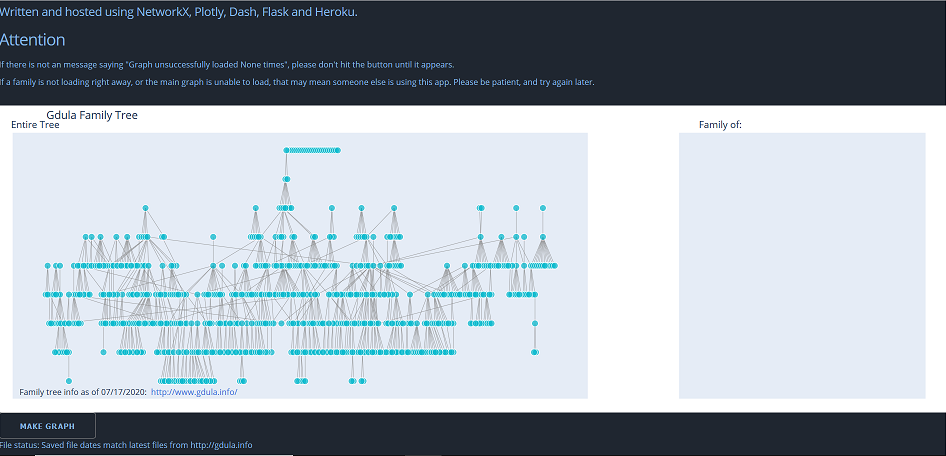

# Gdula Family Tree and Dash app

Was interested in some family genealogy and wanted to get a good sense of the overall tree. So this happened.

[View the Heroku app](https://gdula-tree-v1.herokuapp.com/)

## Getting Started

### Running the app locally
We suggest you to create a separate virtual environment running Python 3 for this app, and install all of the required dependencies there. Run in Terminal/Command Prompt:

```
git clone https://github.com/domergal16/gdula_family_tree.git
cd gdula_family_tree
python3 -m virtualenv venv
```
In UNIX system: 

```
source venv/bin/activate
```
In Windows: 

```
venv\Scripts\activate
```

To install all of the required packages to this environment, simply run:

```
pip install -r requirements.txt
```

and all of the required `pip` packages, will be installed, and the app will be able to run.




Heroku app inspired by [this Dash app](https://dash-gallery.plotly.host/dash-opioid-epidemic/)
